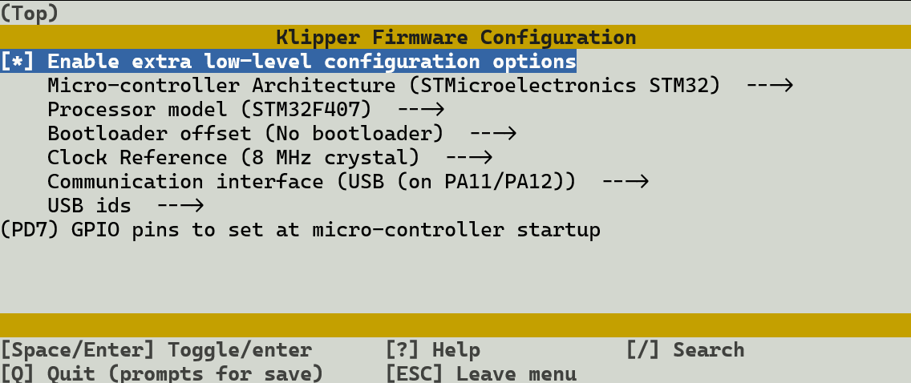

# tmc-4671
TMC 4671 driver for Klipper

The [TMC 4671](https://www.analog.com/media/en/technical-documentation/data-sheets/TMC4671_datasheet_v1.06.pdf
is a closed-loop field-oriented-control servo driver for brushed and brushless DC motors and stepper motors.

This driver allows use of TMC 4671 driver boards with Klipper, in closed-loop mode.

Supported hardware:
* Driver boards:
  * TMC4671+TMC6100-BOB
    * This board can only drive brushless and brushed motors, not stepper motors.
    * 10 A 50 V limits
  * OpenFFBoard TMC 4671 driver kit
    * This board can drive all kinds of motors, including steppers.
    * 20 A 60 V limits
    * On-board thermistor for output MOSFET temnperature monitoring
* Encoders
  * ABZ and AB encoders, voltages as supported by the driver board (most common types work)
    * 6-wire AB encoders with differential outputs work if wired correctly to the driver board. Integrated encoders in LDO motors are of this type, and are tested.
  * Digital Hall encoders
  * Analogue Hall encoders (note: untested, support may be incomplete)
* Motors
  * 3-phase Brushless DC motors
  * 2-phase stepper motors (if supported by the driver board)
  * DC motors (note: untested, but should work)

Klipper driver features:
* PID autotuning for the current and torque control loops
* PID configuration for the velocity and position loops (manual tuning required, for now)
* Feed-forward coefficient configuration (manual tuning required)
* ADC autocalibration
* Encoder autoinitialisation for relative encoders, or absolute encoders not indexed to the electrical phase of the motor
* Sensorless homing (not currently working) by setting a low homing current and detecting failure to track the commanded position within the driver
* On-driver limit switch pin support
* Optional TMC6100 output driver initialisation support (requred for the eval board, not used for OpenFFBoard)
* Virtual steps-per-revolution and microsteps. Klipper treats the TMC 4671 as if it were a conventional stepper driver, all servo activity takes place in hardware. Thus the steps and microsteps in the configuration have no particular relation to the motor, and instead are translated to position angle targets within the TMC 4671.

## How to use this driver:

Wiring:
* Connect the driver board to an SPI bus (SCK, MOSI, MISO), an SPI chip select line, and the STEP/DIR/ENABLE signals of a stepper port (or equivalent GPIOs). If intending to use sensorless homing, add an input GPIO for the status pin. The SPI bus *MUST* support hardware mode. Note that none of these signals on the 4671 are 5V tolerant, so they *MUST* be 3.3V IO.
* Connect the motor's phase lines to the requisite number of phases. For 3 phase motors, make certain that you use two phases with current sensing. For 2 phase (i.e. stepper) motors, make sure that there is a current sense channel for each phase of the motor.
* Brake resistors are required. Mount them somewhere they can get hot without melting things (brake resistor temperatures around 95C are normal, though usually they'll be much cooler).
* Connect the encoder you are using. Note that digital Hall sensors, while they sort of work, will not give good results with Klipper.
* Configure the driver's variables appropriately. This will basically require reading the datasheet for the 4671 and the schematic for your driver board very carefully. The work to make this more user-friendly has not yet been done.
* `current_scale_ma_lsb` is 1.155 for the OpenFFBoard with ACS724T-30AB current sensors, and 1.272 for the EVAL-BOB
* `run_current` should be total peak current, which means 2.8 times the rated current for a stepper motor, maximum. For BLDC, calculate this from the peak power dissipation, if no rated current is given, then multiply by 3.4. Yes, this gives some very large-seeming current values, but the 4671 will not use them except very briefly.
* Configure the matching stepper section with appropriate full_steps_per_rotation and microsteps. Both must be powers of two, and their product must be less than 65536. 256 steps and 8 microsteps works well in most cases.

The following is a working example for driving an LDO 2504-E1000 stepper with OpenFFBoard drivers and the OpenFFBoard MCU. Other stepper motors with 1000 line optical encoders will be similar. LDO use a 6-wire encoder, the signals being A+, A-, B+, B-, 5V and common. A-, B- and common must be wired to the driver board's encoder port GND A+ to A, B+ to B, 5V to 5V, and the board's Z left unconnected. Other encoders may have no signal minus pins. Z can safely be connected, and will be used by the driver.
```ini
[mcu tmcx]
serial: /dev/serial/by-id/usb-Klipper_stm32f407xx_4A0042001451333231353730-if00

[stepper_x]
rotation_distance: 40
microsteps: 2
full_steps_per_rotation: 4096
step_pin: tmcx:PB11
dir_pin: tmcx:PA0
enable_pin: tmcx:PE7
endstop_pin: ^MCU_M1_STOP
homing_speed: 40
homing_retract_dist: 0
position_min: 0
position_max: 350
position_endstop: 350

[tmc4671 stepper_x]
cs_pin: tmcx:PA4
spi_bus: spi1
spi_speed: 2000000
diag_pin: tmcx:PE8
current_scale_ma_lsb: 1.155
adc_temp_reg: AGPI_B
run_current: 7.0
flux_current: 1.6
foc_motor_type: 2
foc_n_pole_pairs: 50
foc_pwm_sv: 0
foc_adc_i_ux_select: 0
foc_adc_i_v_select: 2
foc_adc_i_wy_select: 1
foc_abn_decoder_ppr: 4000
foc_abn_direction: 0
foc_phi_e_selection: 3
foc_position_selection: 9
foc_velocity_selection: 3
foc_pid_flux_i: 0.485
foc_pid_flux_p: 9.66
foc_pid_torque_i: 0.485
foc_pid_torque_p: 9.66
foc_pid_velocity_p: 3.2
foc_pid_position_p: 3.0
foc_mode_ff: 2
foc_feed_forward_velocity_gain: 1.8
foc_feed_forward_velocity_filter_constant: 0.5
foc_feed_forward_torque_gain: 1.8
foc_feed_forward_torque_filter_constant: 0.5
biquad_flux_frequency: 5000
biquad_torque_frequency: 5000
biquad_velocity_frequency: 0
biquad_position_frequency: 0
```

The OpenFFBoard STM32f407 controller board (v1.2.3 or later) can run Klipper. Configure Klipper for STM32407, no bootloader, 8 MHz crystal, USB on PA11/PA12, and set pin PD7 on startup:


The config example above assumes that the STEP and DIR pins have been connected from the controller's GPIO8 to STEP and GPIO6 to DIR, and that the controller is directly plugged in to the driver board.

After configuring as above, the PID will require tuning. Torque and Flux PIDs can be autotuned:
```
SET_STEPPER_ENABLE stepper=stepper_x
TMC_TUNE_PID stepper=stepper_x
```
This will output a line like `PID stepper_x parameters: Kc=9.66 Ki=0.485`, which implies the config as follows:
```ini
foc_pid_flux_i: 0.485
foc_pid_flux_p: 9.66
foc_pid_torque_i: 0.485
foc_pid_torque_p: 9.66
```
It is a good idea to copy the output values to both flux and torque, and use the same values on both motors of a CoreXY printer. These are parameters for the motors, and should match, not parameters for the cartesian axes.

`biquad_torque_frequency` and `biquad_flux_frequency` adjust the digital filters for current measurement. Reasonable values range from about 40 Hz to about 5000 Hz, with most NEMA 17 motors liking values near 1600 Hz for torque and 800 Hz for flux. If the frequency is too high, the motor will make hissing noises while moving, if the frequency is too low it will tend to make noise while stationary, and to round off corners when printing fast. Flux frequencies can be a lot lower than torque frequencies, as the flux current does not need to change as dynamically. Filters for measured velocity and measured position are also available, but I have found no use for those in a 3D printer.

Velocity and position can not be autotuned. Start with `velocity_p` and `position_p` set to 1.0, which should enable the motor to move. Increase velocity coefficient by steps of about 50% until the motor starts making noise at rest, at which point back off until it is quiet, then do the same for position. Again, the coefficients for a CoreXY printer should be equal on both motors.
