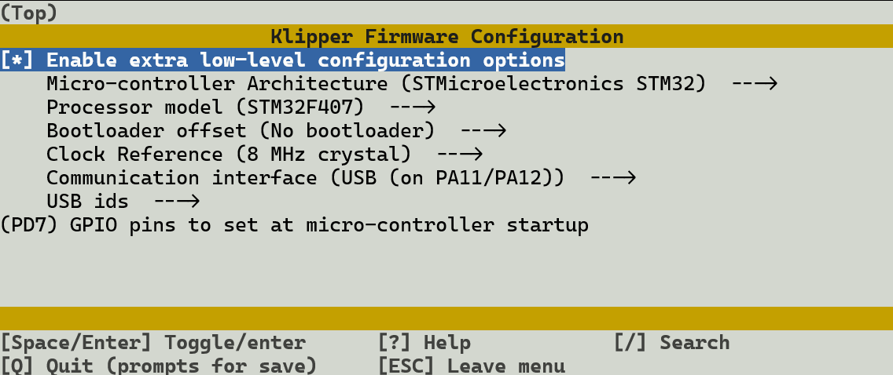

# tmc-4671
TMC 4671 driver for Klipper

*NOTE: This is a beta driver! While it does work, it is only lightly tested, and the setup process in particular is not well tested.*

The [TMC 4671](https://www.analog.com/media/en/technical-documentation/data-sheets/TMC4671-LA_datasheet_rev2.08.pdf)
is a closed-loop field-oriented-control servo driver for brushed and brushless DC motors and stepper motors.

This driver allows use of TMC 4671 driver boards with Klipper, in closed-loop mode.

Supported hardware:
* Driver boards:
  * TMC4671+TMC6100-BOB
    * This board can only drive brushless and brushed motors, not stepper motors.
    * 10 A 50 V limits
  * OpenFFBoard TMC 4671 driver kit
    * This board can drive all kinds of motors, including steppers.
    * 20 A 60 V limits
    * On-board thermistor for output MOSFET temnperature monitoring
  * Ouroboros by Isik's Tech
    * This board can drive *two* of all kinds of motors, including steppers.
* Encoders
  * ABZ and AB encoders, voltages as supported by the driver board (most common types work)
    * 6-wire AB encoders with differential outputs work if wired correctly to the driver board. Integrated encoders in LDO motors are of this type, and are tested.
  * Digital Hall encoders
  * Analogue Hall encoders (note: untested, support may be incomplete)
* Motors
  * 3-phase Brushless DC motors
  * 2-phase stepper motors (if supported by the driver board)
  * DC motors (note: untested, but should work)

Klipper driver features:
* PID autotuning for the current and torque control loops
* PID configuration for the velocity and position loops (manual tuning required, for now)
* ADC autocalibration
* Encoder autoinitialisation for relative encoders, or absolute encoders not indexed to the electrical phase of the motor
* Sensorless homing (not currently working) by setting a low homing current and detecting failure to track the commanded position within the driver
* On-driver limit switch pin support
* Optional TMC6100 output driver initialisation support (requred for the eval board, not used for OpenFFBoard or Ouroboros)
* Virtual steps-per-revolution and microsteps. Klipper treats the TMC 4671 as if it were a conventional stepper driver, all servo activity takes place in hardware. Thus the steps and microsteps in the configuration have no particular relation to the motor, and instead are translated to position angle targets within the TMC 4671.
* Phase current monitoring via ADC (current_ux, current_v, current_wy) — updated every 1 s in the periodic timer callback alongside STATUS_FLAGS, visible in Klipper's `get_status`

## Klipper Installation

To install this plugin, run the installation script using the following command over SSH. This script will download this GitHub repository to your RaspberryPi home directory, and symlink the files in the Klipper extra folder.

```bash
wget -O - https://raw.githubusercontent.com/andrewmcgr/tmc-4671/main/install.sh | bash
```

Then, add the following to your `moonraker.conf` to enable automatic updates:
```ini
[update_manager tmc-4671]
type: git_repo
channel: dev
path: ~/tmc-4671
origin: https://github.com/andrewmcgr/tmc-4671.git
managed_services: klipper
primary_branch: main
install_script: install.sh
```

## How to use this driver:

Wiring:
* Connect the driver board to an SPI bus (SCK, MOSI, MISO), an SPI chip select line, and the STEP/DIR/ENABLE signals of a stepper port (or equivalent GPIOs). If intending to use sensorless homing, add an input GPIO for the status pin. The SPI bus *MUST* support hardware mode. Note that none of these signals on the 4671 are 5V tolerant, so they *MUST* be 3.3V IO.
* Connect the motor's phase lines to the requisite number of phases. For 3 phase motors, make certain that you use two phases with current sensing. For 2 phase (i.e. stepper) motors, make sure that there is a current sense channel for each phase of the motor.
* Brake resistors are required. Mount them somewhere they can get hot without melting things (brake resistor temperatures around 95C are normal, though usually they'll be much cooler).
* Connect the encoder you are using. Note that digital Hall sensors, while they sort of work, will not give good results with Klipper.
* Configure the driver's variables appropriately. This will basically require reading the datasheet for the 4671 and the schematic for your driver board very carefully. The work to make this more user-friendly has not yet been done.
* `current_scale_ma_lsb` is 1.155 for the OpenFFBoard with ACS724T-30AB current sensors, and 1.272 for both the EVAL-BOB and Ouroboros
* `run_current` should be total peak current, which means 1.4 times the rated current for a stepper motor, maximum. For BLDC, calculate this from the peak power dissipation, if no rated current is given, then multiply by 2.8. Yes, this gives some very large-seeming current values, but the 4671 will not use them except very briefly.
* `voltage_scale_ratio` encodes the VM voltage-divider ratio on your driver board. The default (10.91) is correct for the OpenFFBoard. To calibrate empirically: with Klipper running, read `ADC_VM_RAW` via `DUMP_TMC`, then set `voltage_scale_ratio = VM_actual * 13107 / (ADC_VM_RAW - 32768)` where `VM_actual` is the measured bus voltage in volts and 32768 is the midscale offset. **Breaking change**: if you previously had an explicit `voltage_scale_ratio` in your config, halve that value (the internal ADC reference constant was corrected from 1.25 V to 2.5 V, requiring all `voltage_scale_ratio` values to be divided by two).
* Configure the matching stepper section with appropriate full_steps_per_rotation and microsteps. Both must be powers of two, and their product must be less than 65536. 4096 steps and 2 microsteps works well in most cases.

The following is a working example for driving an LDO 2504-E1000 stepper with OpenFFBoard drivers and the OpenFFBoard MCU. Other stepper motors with 1000 line optical encoders will be similar. LDO use a 6-wire encoder, the signals being A+, A-, B+, B-, 5V and common. A-, B- and common must be wired to the driver board's encoder port GND A+ to A, B+ to B, 5V to 5V, and the board's Z left unconnected. Other encoders may have no signal minus pins. Z can safely be connected, and will be used by the driver.
```ini
[mcu tmcx]
serial: /dev/serial/by-id/usb-Klipper_stm32f407xx_4A0042001451333231353730-if00

[stepper_x]
rotation_distance: 40
microsteps: 2
full_steps_per_rotation: 4096
step_pin: tmcx:PB11
dir_pin: tmcx:PA0
enable_pin: tmcx:PE7
endstop_pin: ^MCU_M1_STOP
homing_speed: 40
homing_retract_dist: 0
position_min: 0
position_max: 350
position_endstop: 350

[tmc4671 stepper_x]
cs_pin: tmcx:PA4
spi_bus: spi1
spi_speed: 2000000
diag_pin: tmcx:PE8
current_scale_ma_lsb: 1.155
run_current: 3.5
flux_current: 0.02
foc_motor_type: 2
foc_n_pole_pairs: 50
foc_pwm_sv: 0
foc_adc_i_ux_select: 0
foc_adc_i_v_select: 2
foc_adc_i_wy_select: 1
foc_abn_decoder_ppr: 4000
foc_abn_direction: 0
foc_phi_e_selection: 3
foc_position_selection: 9
foc_velocity_selection: 9
foc_pid_flux_i: 0.485
foc_pid_flux_p: 9.66
foc_pid_torque_i: 0.485
foc_pid_torque_p: 9.66
foc_pid_velocity_i: 0.00826
foc_pid_velocity_p: 1.408
foc_pid_position_i: 0.00277
foc_pid_position_p: 2.82
biquad_flux_frequency: 0
biquad_torque_frequency: 0
biquad_velocity_frequency: 0
biquad_position_frequency: 0
```

The OpenFFBoard STM32f407 controller board (v1.2.3 or later) can run Klipper. Configure Klipper for STM32407, no bootloader, 8 MHz crystal, USB on PA11/PA12, and set pin PD7 on startup:


The config example above assumes that the STEP and DIR pins have been connected from the controller's GPIO8 to STEP and GPIO6 to DIR, and that the controller is directly plugged in to the driver board.

After configuring as above, the PID will require tuning. Torque and Flux PIDs can be autotuned:
```
SET_STEPPER_ENABLE stepper=stepper_x
TMC_TUNE_PID stepper=stepper_x
```
This will output a line like `PID stepper_x parameters: Kc=9.66 Ki=0.485`, which implies the config as follows:
```ini
foc_pid_flux_i: 0.485
foc_pid_flux_p: 9.66
foc_pid_torque_i: 0.485
foc_pid_torque_p: 9.66
```
It is a good idea to copy the output values to both flux and torque, and use the same values on both motors of a CoreXY printer. These are parameters for the motors, and should match, not parameters for the cartesian axes.

`biquad_torque_frequency` and `biquad_flux_frequency` adjust the digital filters for current measurement. Reasonable values range from about 40 Hz to about 5000 Hz, with most NEMA 17 motors liking values near 1600 Hz for torque and 800 Hz for flux. If the frequency is too high, the motor will make hissing noises while moving, if the frequency is too low it will tend to make noise while stationary, and to round off corners when printing fast. Flux frequencies can be a lot lower than torque frequencies, as the flux current does not need to change as dynamically. Filters for measured velocity and measured position are also available, but I have found no use for those in a 3D printer.

Velocity and position may be manually tuned. Start with `velocity_p` and `position_p` set to 1.0, which should enable the motor to move. Increase velocity coefficient by steps of about 50% until the motor starts making noise at rest, at which point back off until it is quiet, then do the same for position. Again, the coefficients for a CoreXY printer should be equal on both motors.

Velocity and position may also be autotuned, by reference to parameters from the motor datasheet.
```
TMC_TUNE_MOTION_PID LAMBDA_V=80 LAMBDA_P=180 HOLDING_CURRENT=2.5 HOLDING_TORQUE=0.055 STEPPER=stepper_y
```
or
```
TMC_TUNE_MOTION_PID LAMBDA_V=80 LAMBDA_P=180 KT=0.022 STEPPER=stepper_y
```
depending on whether you know a KT value (in nM/A) or holding specifications. Lambda_v and Lambda_p are measures of how aggressive the tuning will be. Lambda_v can go from approximately 45 up, and Lambda_p should be at least twice Lambda_v; the default values are Lambda_v=100 and Lambda_p=400. `SAVE_CONFIG` will save the tuning values. The command will also suggest filter frequencies, but will not apply them.

If the motors make noise at rest after autotuning, increase the Lambda values. If not, consider decreasing them; the minimum value that remains quiet at rest is likely also the optimal value.

## G-code command reference

All commands take `STEPPER=<name>` to select the driver, e.g. `STEPPER=stepper_x`.

### INIT_TMC

Re-initialises all TMC 4671 registers from the config and runs ADC offset calibration. Useful after a power glitch without a full Klipper restart.

```
INIT_TMC STEPPER=stepper_x
```

### SET_TMC_CURRENT

Get or set the run current limit.

```
SET_TMC_CURRENT STEPPER=stepper_x [CURRENT=<amps>]
```

Without `CURRENT`, reports the currently active limit. With `CURRENT`, updates the `PID_TORQUE_FLUX_LIMITS` register immediately.

### TMC_TUNE_PID

Autotune flux and torque PID coefficients and queue the results for `SAVE_CONFIG`.

```
TMC_TUNE_PID STEPPER=stepper_x [CURRENT_BANDWIDTH=<hz>] [SIMC=<0|1>] [CHECK=<0|1>] [DERATE=<factor>]
```

| Parameter | Default | Description |
|---|---|---|
| `CURRENT_BANDWIDTH` | 1800.0 | Target closed-loop current bandwidth in Hz. Higher values are faster but noisier. |
| `SIMC` | 0 | Use S-IMC setpoint-change experiment instead of the bandwidth method. |
| `CHECK` | 0 | With `SIMC=1`: test the *existing* gains instead of starting from scratch. |
| `DERATE` | 1.6 | With `SIMC=1`: initial gain derate factor. |

The default (bandwidth) method derives P and I analytically from the measured motor R and L. The `SIMC` method runs a live setpoint-change experiment and fits a first-order-plus-dead-time model — more accurate but takes longer and requires the motor to be active.

Output example: `PID stepper_x parameters: Kc=9.66 Ki=0.485`

### TMC_TUNE_MOTION_PID

Autotune velocity and position PID coefficients using S-IMC and queue the results for `SAVE_CONFIG`.

```
TMC_TUNE_MOTION_PID STEPPER=stepper_x KT=<nm/a> [LAMBDA_V=<val>] [LAMBDA_P=<val>]
TMC_TUNE_MOTION_PID STEPPER=stepper_x HOLDING_CURRENT=<a> HOLDING_TORQUE=<nm> [LAMBDA_V=<val>] [LAMBDA_P=<val>]
```

| Parameter | Default | Description |
|---|---|---|
| `KT` | — | Motor torque constant in Nm/A. |
| `HOLDING_CURRENT` | — | Rated holding current in A (alternative to `KT`). |
| `HOLDING_TORQUE` | — | Rated holding torque in Nm (alternative to `KT`). |
| `LAMBDA_V` | 100.0 | Velocity loop closed-loop time constant (smaller = faster/noisier). |
| `LAMBDA_P` | 400.0 | Position loop closed-loop time constant. Should be at least 2× `LAMBDA_V`. |

The command also suggests biquad filter frequencies but does not apply them.

### TMC_DEBUG_TUNING

Report what the PID tuning helpers would compute given the current motor parameters, without writing anything to the controller. Compares computed values against the currently active register values.

```
TMC_DEBUG_TUNING STEPPER=stepper_x [CURRENT_BANDWIDTH=<hz>] [LAMBDA_V=<val>] [LAMBDA_P=<val>] [KT=<nm/a>] [R=<ohm>] [L=<henry>]
TMC_DEBUG_TUNING STEPPER=stepper_x HOLDING_CURRENT=<a> HOLDING_TORQUE=<nm> [...]
```

| Parameter | Default | Description |
|---|---|---|
| `CURRENT_BANDWIDTH` | 1800.0 | Bandwidth in Hz for the current PID calculation. |
| `LAMBDA_V` | 100.0 | Velocity loop time constant for the motion PID calculation. |
| `LAMBDA_P` | 400.0 | Position loop time constant for the motion PID calculation. |
| `KT` | — | Motor torque constant in Nm/A (required for motion PID section). |
| `HOLDING_CURRENT` + `HOLDING_TORQUE` | — | Alternative way to supply Kt. |
| `R` | — | Override motor winding resistance in Ω. Defaults to the measured value. |
| `L` | — | Override motor winding inductance in H. Defaults to the measured value. |

If motor R and L have not yet been measured (startup alignment pending), the current PID section reports that instead of computing. Providing `R` or `L` overrides the measured value for the computation without changing what is stored; the output labels overridden values accordingly. The motion PID section is skipped if no torque constant is provided.

### SET_TMC_BIQUAD_FILTER

Configure a biquad filter on the fly.

```
SET_TMC_BIQUAD_FILTER STEPPER=stepper_x FILTER=<target> [FREQUENCY=<hz>] [TYPE=<type>] [SLOPE=<q>]
```

| Parameter | Values | Description |
|---|---|---|
| `FILTER` | `flux`, `torque`, `velocity`, `position` | Which signal path to filter. |
| `FREQUENCY` | 0 – 100000000 | Cutoff frequency in Hz. 0 disables the filter. |
| `TYPE` | `lpf`, `notch`, `apf` | Filter topology. Default: `lpf`. |
| `SLOPE` | any positive float | Q factor / slope. Default: 0.707 (Butterworth). |

### SET_TMC_FIELD

Read or write any TMC 4671 register field by name.

```
SET_TMC_FIELD STEPPER=stepper_x FIELD=<name> [VALUE=<int>|FVAL=<float>]
```

Without `VALUE` or `FVAL`, reads and prints the current value of the field. `FVAL` uses the field's configured floating-point converter (e.g. for PID coefficients).

### DUMP_TMC

Read and display TMC 4671 registers.

```
DUMP_TMC STEPPER=stepper_x [GROUP=<name>|REGISTER=<name>|FIELD=<name>]
```

Available groups: `default`, `hall`, `abn`, `adc`, `aenc`, `pwm`, `pidconf`, `pid`, `step`, `filters`. Without arguments, dumps the `default` group.

### DUMP_TMC6100

Read and display TMC6100 gate driver registers. Only available when `drv_cs_pin` is configured.

```
DUMP_TMC6100 STEPPER=stepper_x [GROUP=<name>|REGISTER=<name>|FIELD=<name>]
```

### TMC_DEBUG_VOLTAGE

Report the motor supply voltage (VM) and the FOC d/q axis voltages in both raw counts and volts.

```
TMC_DEBUG_VOLTAGE STEPPER=stepper_x
```

### TMC_DEBUG_CURRENT

Report phase currents, FOC target and actual d/q axis currents, and the active current limit.

```
TMC_DEBUG_CURRENT STEPPER=stepper_x
```

### TMC_MEASURE_IMPEDANCE

Perform a high-frequency AC injection test with stochastic demodulation to measure the distinct d-axis and q-axis inductances (Ld, Lq) and the motor's saliency ratio. 

```
TMC_MEASURE_IMPEDANCE STEPPER=stepper_x [F_INJECT=<hz>] [N_SAMPLES=<int>]
```

| Parameter | Default | Description |
|---|---|---|
| `F_INJECT` | 2317.0 | Non-integer high-frequency injection frequency in Hz. |
| `N_SAMPLES` | 500 | Number of stochastic samples to gather. |

The command applies a rotating AC voltage vector on top of the measured motor winding resistance (using the motor resistance measured during startup alignment) and accumulates raw d/q current readings stochastically to extract distinct admittances, converting them to Ld and Lq inductances. Requires prior startup alignment.

### TMC_DEBUG_MOTOR

Report the motor resistance, average inductance, estimated Ld inductance, estimated Lq inductance, and spatial saliency ratio measured during the last startup alignment (or manual `TMC_MEASURE_IMPEDANCE` run).

```
TMC_DEBUG_MOTOR STEPPER=stepper_x
```

Values are populated after the first successful `klippy:ready` alignment sequence. If the driver has not yet aligned, the command says so.

### TMC_DEBUG_MOVE

Run a raw motion test in a chosen mode. The motor must be free to move. Results are logged to the Klipper log.

```
TMC_DEBUG_MOVE STEPPER=stepper_x <VELOCITY=<int>|TORQUE=<int>|POSITION=<int>|OPENVEL=<int>>
```

| Parameter | Description |
|---|---|
| `VELOCITY` | Target in velocity-mode raw units. |
| `TORQUE` | Target in torque-mode raw units. |
| `POSITION` | Target in position-mode raw units. |
| `OPENVEL` | Open-loop velocity in raw units (no position feedback). |
